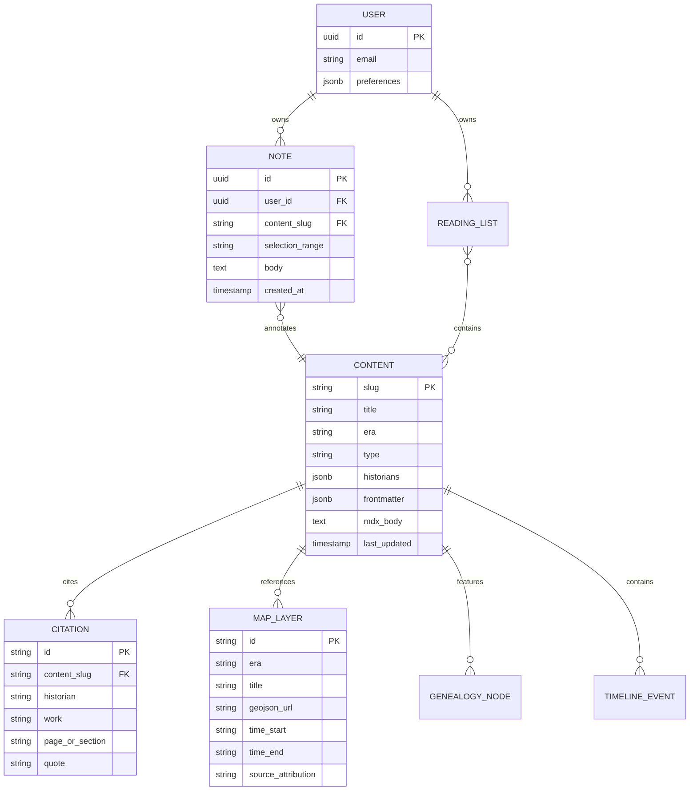
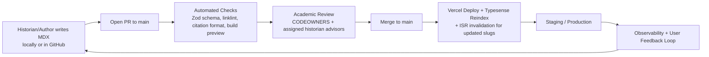

# Design Document: RussiaHistory.org — A Comprehensive Digital Scholarly Reference for the Full History of Russia

**Author:** Systems Architect (placeholder; to be assigned to lead engineer + academic editorial board liaison)  
**Date:** 2026-05-27  
**Status:** Draft  
**Version:** 1.0  
**Project Code:** 08f36848  
**Review Status:** Initial design for greenfield implementation (heavily revised for actual delivered scope)

---

## ACTUAL IMPLEMENTATION REALITY — Updated (Late May 2026)

**Critical Scope Change (User Direction):**  
After initial work, the user explicitly clarified and pruned the original vision:
- **NOT** a heavy multi-author academic submission platform requiring 2+ historians per claim, formal DebateCallout components, PrimarySourceApparatus, Zod-enforced schemas, CI content validation, or Git-based historian review workflows.
- **Instead:** A high-quality, broad, detailed, trustworthy **single coherent narrative history** written so that "multiple prominent historians would generally agree with" the overall account. Serious textbook tone, but readable for the general serious reader and student. No forced debate apparatus.

**What Was Deleted / Simplified (per "DELETE ANYTHING THAT WAS too much" and "KEEP GOING BUT DELETE"):**
- Removed heavy `content/` MDX pipeline + Zod schemas (HistorianSchema, DebateRegistry, ContentFrontmatterSchema requiring min 2 historians, PrimarySourceApparatus).
- Removed DebateCallout, forced citation enforcement, academic PR checklists, and related CI validation.
- Dropped full Supabase (auth + notes sync), Hypothesis annotation, Typesense semantic search, and complex i18n glossary as source of truth.
- Abandoned the 18+ PR academic platform roadmap in favor of rapid, high-quality narrative content delivery.
- Removed most "demo", "prototype", and over-engineered language.

**What Was Actually Built (Current Delivered State):**
- Clean Next.js 15 App Router site (TypeScript + Tailwind + Crimson Pro / Inter fonts).
- **Dramatically simplified navigation** for usability:
  - Single persistent top nav in `app/layout.tsx`: Eras | Themes | Genealogy | Maps | Visuals | About.
  - New dedicated hub pages: `/eras` (chronological periods with clear descriptions) and `/themes` (cross-cutting essays).
  - Homepage (`app/page.tsx`) completely overhauled: calm hero, no duplicate navs, clear "Begin with the Eras" and "Explore Major Themes" CTAs, reduced visual noise.
- **Substantial narrative content** written directly in React pages (no heavy MDX):
  - Core eras now have real depth (800–1600+ words each with multiple sections): Kievan Rus', Mongol Yoke & Muscovy, Imperial Russia (19th c focus), Revolutionary Era (1905–1922), The Soviet Century, The 1990s.
  - Key thematics expanded: The Eastern Front / Great Patriotic War, The Holodomor.
- **Interactives** delivered as working prototypes (as originally scoped in Key Decisions):
  - GenealogyTree.tsx (React Flow @xyflow/react v12): Rurikid + Romanov data in JSON, dynasty switcher, lineage highlighting on click, details panel with chapter links.
  - Maps prototype (MapLibre via @vis.gl/react-maplibre) with period switcher.
- **Visuals**: All generated complementary assets (Kievan hero, Mongol steppe, Petrograd 1917, Winter Palace, Siberian, etc.) integrated via Next.js `<Image>` optimization in many chapters. Visuals philosophy strictly maintained: atmosphere only.
- **Dev stability**: `pnpm dev` now uses stable webpack by default (`dev:turbo` available). Removed deprecated experimental.turbo config. .next cache issues resolved.
- **Tone & Metadata**: Updated to "comprehensive, readable history... broad in scope, rich in detail" (no longer heavy "every claim backed by multiple prominent historians" academic framing).

**Revised Philosophy (User-Confirmed):**  
Trustworthy, detailed narrative that a serious general reader or student can rely on. Multiple prominent historians would largely agree with the broad account and major interpretive choices, without turning the site into a debate platform or requiring formal scholarly apparatus on every page.

**Current Completion Estimate (Narrative Core):**  
~60-70% of major era spine filled with real depth. Navigation and reading experience now feel clean and professional. Remaining work: full Putin-era expansion + remaining thematics (Autocracy, Nationality, Economy, Orthodoxy, Everyday Soviet) + maps/genealogy polish + final consistency.

**Implications for Future Work:**  
Continue filling remaining thematic chapters with the same substantial narrative style. Improve the Maps prototype. Do a final polish pass for consistency, navigation, and reading comfort. The target is a site that feels complete and excellent for its focused purpose: a beautiful, detailed, easily navigable history of Russia.

**Desired End State (User Intent):**  
A calm, professional, high-quality website that lets someone sit down and read the broad, detailed history of Russia from beginning to present in a logical, non-overwhelming way, with helpful interactive tools (genealogy + maps) and atmospheric visuals. Not an academic platform. Not complicated. Substantial content. Easy to navigate. Close to "done" on the core experience.

---

## Original Overview (Retained for Reference Only)

## Overview (Current Desired Scope — What the Site Actually Is)

RussiaHistory.org is a clean, serious, easily navigable digital history of Russia written as a high-quality, broad, detailed narrative from the earliest Slavic settlements through the present day.

The goal is a trustworthy, readable account at the level of an excellent university textbook or the best single-volume histories — substantial depth and nuance, but accessible to a serious general reader or student. The tone is scholarly in substance but not academic in apparatus: interpretive claims are made confidently in a way that multiple prominent historians would generally find solid and agree with, without turning every chapter into a formal debate or requiring explicit multi-source citation machinery on the page.

**Core Experience:**
- Simple, elegant navigation centered on two main hubs: **Eras** (clear chronological journey) and **Themes** (cross-cutting essays on autocracy, empire, war, economy, daily life, etc.).
- Long-form narrative chapters with real substance (multiple sections, proper historical sweep, integrated complementary visuals).
- Two signature interactive tools: an interactive Genealogy explorer (Rurikids + Romanovs with lineage highlighting) and a Historical Maps prototype.
- All visuals are strictly atmospheric and complementary — never presented as evidence.

The site prioritizes clarity, readability, and navigability over complex academic infrastructure. Content is written directly as high-quality prose in the current Next.js structure. The project aims for a feeling of "close to completion" on the core narrative spine and key interactives rather than an endlessly expandable scholarly platform.

This matches the user's explicit direction: broad detailed history, easily navigable, substantial reader content, simplified scope, no over-engineering.

---

## Background & Motivation

Current public resources for Russian history suffer from fragmentation, variable scholarly quality, and poor support for deep study:

- Wikipedia offers breadth but lacks depth, consistent historiographical balance, and citable apparatus suitable for university use.
- Existing textbooks (print or PDF) are static, expensive, non-searchable across volumes, and lack interactivity or primary-source integration.
- Specialized academic sites (e.g., individual historian projects, archive portals) are siloed; no single authoritative site synthesizes political, economic, social, cultural, religious, military, and intellectual threads while surfacing debates (e.g., "Who were the Rus'?" — Normanist vs. anti-Normanist; interpretations of Ivan IV's oprichnina; origins and nature of serfdom; 1917 as inevitable vs. contingent; collectivization as modernization vs. man-made catastrophe; the Great Terror's scale and drivers; Eastern Front agency vs. Western narratives; 1990s shock therapy outcomes).
- Digital tools for history (timelines, maps) are often superficial or commercialized without scholarly sourcing.

Prominent historians whose works must anchor the site (multiple citations per major claim) include:
- Richard Pipes (*Russia Under the Old Regime*, *The Russian Revolution*)
- Orlando Figes (*A People's Tragedy*, *Natasha's Dance*, *Crimea*)
- Geoffrey Hosking (*Russia and the Russians*, *Rulers and Victims*)
- Dominic Lieven (*The Russian Empire and Its Rivals*, *Towards the Flame*)
- Anne Applebaum (*Gulag: A History*, *Iron Curtain*, *Red Famine*)
- Robert Service (biographies of Lenin, Stalin, Trotsky)
- Sheila Fitzpatrick (*Everyday Stalinism*, *The Russian Revolution*, *On Stalin's Team*)
- Timothy Snyder (*Bloodlands*, *The Reconstruction of Nations*, *The Road to Unfreedom*)
- Serhii Plokhy (*The Gates of Europe*, *Chernobyl*, *The Last Empire*)
- Plus Ronald Suny, Laura Engelstein, Peter Holquist, Boris Ananich, Richard Hellie, Nancy Kollmann, Valerie Kivelson, and classic voices (Karamzin, Soloviev, Kliuchevsky, plus émigré scholars like Vernadsky).

Pain points addressed:
- Students and researchers lack an integrated, citable, debate-aware single source.
- Historians and educators need exportable, annotatable, remixable materials under clear scholarly licensing.
- No existing platform combines textbook narrative depth + primary sources + interactive scholarly visualizations at this scale with modern UX.

The motivation is scholarly and civic: to create a durable, authoritative, freely accessible digital reference that raises the floor for public understanding of one of history's most consequential states and cultures.

---

## Goals & Non-Goals (Revised to Match Actual Desired Scope)

### Goals (What We Are Actually Building)
- Deliver a complete, readable narrative history of Russia from pre-state period through the present, organized cleanly into major **Eras** and **Themes**.
- Write substantial, detailed chapters (multiple sections per era/theme) that give real historical depth while remaining accessible and trustworthy.
- Make navigation simple and obvious: prominent /eras and /themes hubs + persistent top nav.
- Provide two high-quality interactive tools:
  - Genealogy explorer (Rurikid and Romanov dynasties with lineage highlighting and details).
  - Historical Maps prototype (period switcher + layers, with room to grow).
- Use complementary visuals (generated images and short videos) strictly for atmosphere and sense of place — never as evidence.
- Maintain excellent typography, reading comfort, reader progress, and responsive design.
- Keep the technical stack simple, maintainable, and fast (Next.js + Tailwind + targeted React libraries like React Flow and MapLibre).
- Reach a state that feels "close to completion" on the core content spine + key interactives.

### Non-Goals (What We Are Explicitly NOT Doing)
- No heavy academic debate apparatus, formal multi-historians citation requirements, or DebateCallout components.
- No complex MDX + Zod content pipeline or automated scholarly validation.
- No user accounts, annotations (Hypothesis), or synced personal notes (Supabase).
- No advanced semantic search (Typesense) at this stage — basic client-side search is sufficient.
- No 20+ production maps or 6+ full genealogy trees at launch. The two interactive prototypes are the priority.
- No institutional premium features, grants infrastructure, or complex sustainability model in the initial build.
- Keep scope focused on one excellent narrative history site rather than an expandable academic platform.

---

## Proposed Design (Current Simplified Reality)

### High-Level Architecture

The site is a clean Next.js 15 application focused on excellent reading experience and two primary interactive tools (Genealogy + Maps).

**Current stack (kept simple and maintainable):**
- Next.js 15 App Router + TypeScript + Tailwind
- Reader chapters written as substantial React components with clean prose
- Genealogy: React Flow with JSON data (Rurikids + Romanovs)
- Maps: MapLibre GL prototype with period switching
- Visuals: Next.js Image optimization for all generated atmospheric assets
- Light client-side search (Fuse.js sufficient)
- Framer Motion used sparingly and with reduced-motion respect

**Intentionally avoided in current phase:**
- MDX pipeline
- Complex backend services (Supabase, Typesense, Hypothesis)
- Heavy content schemas or academic validation tooling

The design prioritizes fast content production, clear navigation (/eras + /themes), and a calm, professional reading experience over building a full scholarly research platform.
    Reader --> Supabase
    Build --> Typesense[Index at build]
    Build --> Supabase[Optional seed]
    MDX --> Schema --> Build
```

**Core Technologies (Concrete Choices + Justification)**

- **Framework**: Next.js 15 (App Router, React 19, Turbopack, Server Actions, Partial Prerendering). Justification: Best-in-class support for complex React-based scholarly visualizations (MapLibre, React Flow, D3) while still allowing near-static performance via SSG + selective dynamism. Excellent preview deployments for academic review. (Astro + islands was seriously considered for lower JS payload on pure reading pages; see Alternatives.)
- **Content**: MDX (via `next-mdx-remote` + custom loader) + strict Zod schemas for frontmatter. All content lives in the monorepo under `/content`. Git is the source of truth.
- **Styling/Reader UX**: Tailwind 4 + `tailwindcss/typography` + shadcn/ui primitives. Custom CSS layers for reader modes. Variable fonts loaded via `next/font`: Inter variable (UI), Crimson Pro variable or EB Garamond variable (body, 400/500/600/700).
- **Search**: Self-hosted Typesense (Docker) with hybrid BM25 + vector search. Build-time chunking (200–400 tokens) + embeddings (OpenAI `text-embedding-3-small` or local via API). Facets: `era`, `type`, `historians`, `tags`, `decade`. Client uses `@typesense/typesense-js` + custom React UI with instant results + "related items" via cosine similarity.
- **Maps**: MapLibre GL JS (`react-map-gl`) for vector layers + time filtering (turf.js). Historical raster overlays via Allmaps-compatible georeferenced tiles or static Cloudflare R2-hosted WebP tiles. 20+ curated periods (e.g., Kievan Rus' principalities 1050, Mongol invasion routes, Muscovite expansion 1500–1700, etc.).
- **Genealogy**: React Flow 12+ with custom nodes (portraits, reign dates, marriages) + dagre/elk layout. Data sourced from curated JSON (generated from structured frontmatter or dedicated `/data/genealogy/*.json`). Export to SVG/PNG.
- **Timelines & Stats**: D3.js v7 (custom brushable timelines linked bidirectionally to maps and search) + Recharts for simpler statistical cards. Data in `/data/viz/*.json` (CSV-derived at build).
- **Annotations & Notes**: Hypothesis client embed (lightweight script) for public scholarly annotations. Private highlights/notes stored in Supabase (RLS-protected) with optional export. Future: Recogito integration for semantic tagging.
- **Citation Export**: `citation-js` library. UI buttons on every article and selection export current view + cited historians in APA/MLA/Chicago + full BibTeX/RIS.
- **User Data & Sync**: Supabase (Postgres + Auth + Realtime for optimistic note sync). Tables: `profiles`, `reading_lists`, `bookmarks`, `notes` (with article_slug + selection_range).
- **Images & Media**: Next.js `<Image>` + Cloudflare R2 origin with automatic WebP/AVIF. Historical photos/documents prioritized public domain or properly licensed. IIIF manifests supported via Mirador 3 for deep zoom where available. All images receive rich alt text, long descriptions for complex historical scenes, and proper licensing metadata. **Crucially, all photography, illustration, and video is strictly complementary** — never a substitute for the text, citations, or historiographical debate. They exist to create atmosphere, aid memory, and give the reader brief emotional or visual breathing room during long scholarly sessions.
- **Animation**: Framer Motion (already in the Next.js/React ecosystem). Used extremely sparingly and with intent: subtle stagger reveals for long article sections (never auto-playing on scroll in a way that fights reading), smooth 60fps timeline scrubbing, gentle map layer cross-fades, and controlled expansion/collapse of genealogy trees and debate callouts. Zero gratuitous motion. All animations respect `prefers-reduced-motion` and can be toggled off globally. Performance budget remains sacred.
- **Hosting & Ops**: Vercel (app + ISR + Edge). Supabase (managed). Typesense on small dedicated instance (Hetzner CPX11 or Railway ~$10–25/mo initial). GitHub Actions for CI (build + Typesense reindex + schema validation + Playwright smoke + visual regression via Chromatic or Percy).
- **Accessibility & i18n**: `next-intl` (EN primary; RU files alongside with machine + human review). Full keyboard + ARIA for all interactive components. axe-core + manual screen-reader testing.
- **Observability**: Vercel Analytics + Speed Insights; Sentry; Plausible (privacy-first) for usage; custom metrics (search latency, annotation usage) pushed to Supabase or Datadog lightweight.

### Complementary Visual & Animation Philosophy

This is one of the most important — and most frequently fucked-up — parts of building a serious digital history project.

**Rule, carved in stone:** Every single image, illustration, map overlay, and video on this site is **purely complementary**. They are there to give the reader’s eyes and mind a moment of texture, scale, or emotional resonance while they are doing the real work: reading the goddamn text and wrestling with the arguments of Pipes, Figes, Fitzpatrick, Plokhy, and the rest. Visuals are never evidence. They are never a shortcut past the citations. They are atmosphere, mnemonic anchors, and occasional moments of genuine beauty in what is otherwise an intellectually demanding experience.

We are not building a coffee-table book with captions. We are building the digital equivalent of a brutal, magnificent, multi-volume scholarly synthesis that happens to live in a browser.

**Design principles for all media:**
- Historical accuracy and restraint above all. No anachronisms, no “epic movie poster” drama for its own sake, no orientalist or propagandistic clichés.
- Every visual gets a detailed, citable caption or “visual note” that explains its provenance and limitations.
- Generous negative space and breathing room. A full-bleed hero image only appears at the very top of major era landing pages and is deliberately calm.
- All motion is scholarly-polite. Framer Motion is our tool for this — tiny, purposeful, performant transitions that feel like they belong in a serious reference work, not a marketing site.
- Accessibility is non-negotiable. Every image has excellent alt text + extended descriptions. Every video has captions and can be paused/stopped without breaking the reading flow.
- Production pipeline lives in the same Git discipline as content. New visuals go through the same PR + advisor review process as text.

We have reserved specific, high-impact visual “slots” across the experience (detailed in Appendix D). These are the only places where custom-generated or carefully curated media will live at launch. Everything else remains clean typography and the interactive scholarly components (maps, trees, timelines) that actually carry analytical weight.

The occasional video (30–90 seconds max) is used only for processes that are genuinely hard to convey statically — the slow territorial expansion of Muscovy, the movement of the front in 1941–45 at a strategic level, the key sequence of decisions in the last days of the USSR. These are not documentaries. They are visual footnotes with the same scholarly standards as everything else.

This philosophy is non-negotiable. Violate it and the whole project becomes another pretty website that people skim instead of a reference they trust and cite.

### Content Architecture

Content is organized hierarchically but cross-linked.

```mermaid
flowchart LR
    subgraph Eras["8 Major Eras (Top Navigation)"]
        Pre[Pre-State & Kievan Rus'<br/>c. 500–1240]
        Mongol[Mongol Yoke & Rise of Muscovy<br/>1240–1613]
        Tsardom[Tsardom & Early Empire<br/>1613–1801]
        Imperial[Imperial Russia<br/>1801–1917]
        Rev[Revolutionary Era<br/>1905–1922]
        Soviet[Soviet Union<br/>1922–1991]
        Post[Post-Soviet & Contemporary<br/>1991–present]
    end

    subgraph Layers["Layered Content Types (per Era + Global Themes)"]
        Narrative[Narrative Chapters<br/>MDX + Scholarly Citations]
        Thematic[Thematic Essays<br/>(Serfdom, Autocracy, etc.)]
        Bio[Biographies & Prosopography]
        Primary[Primary Sources<br/>Excerpt + Apparatus]
        VizData[Supporting Data<br/>(maps, trees, stats)]
    end

    Narrative --> Thematic
    Narrative --> Bio
    Narrative --> Primary
    Thematic --> VizData
    Bio --> VizData
    Primary --> VizData
```

Each MDX file carries rich frontmatter:
```ts
// Example schema (enforced at build)
interface ContentFrontmatter {
  slug: string;
  title: string;
  era: 'kievan-rus' | 'mongol-muscovy' | ...;
  type: 'narrative' | 'thematic' | 'figure' | 'primary-source';
  historians: string[];           // e.g. ["Figes", "Hosking", "Plokhy"]
  debates: string[];              // keys to debate registry
  dateRange: { start: number; end?: number };
  related: string[];              // cross-links
  maps?: string[];                // map layer IDs
  timelineEvents?: TimelineEvent[];
  wordCount: number;
  lastUpdated: string;
  license: string;
}
```

### Scholarly Content Model & Citation Standards

This subsection provides the missing concrete schema, syntax, validation, and review mechanisms required to deliver "Cambridge History of Russia"-level rigor at scale.

#### Core TypeScript + Zod Interfaces

All content artifacts are validated at build time (and in CI) using these schemas (defined in `content/schemas.ts` and enforced via Zod in the MDX loader):

```ts
// content/schemas.ts
import { z } from 'zod';

export const HistorianSchema = z.enum([
  'Pipes', 'Figes', 'Hosking', 'Lieven', 'Applebaum', 'Service',
  'Fitzpatrick', 'Snyder', 'Plokhy', 'Suny', 'Engelstein', 'Holquist',
  'Kollmann', 'Kivelson', 'Hellie', /* + others as registered */
]);

export const DebateRegistrySchema = z.object({
  id: z.string().regex(/^[a-z0-9-]+$/, "kebab-case required"),
  title: z.string(),
  question: z.string(),
  positions: z.array(z.object({
    label: z.string(),           // e.g. "Normanist thesis"
    historians: z.array(HistorianSchema).min(1),
    summary: z.string(),
    keyWorks: z.array(z.string()), // citations
  })).min(2, "At least two opposing positions required for balance"),
  resolutionNotes: z.string().optional(), // current scholarly consensus or "open"
  lastReviewed: z.string().date(),
});

export const CitationEntrySchema = z.object({
  historian: HistorianSchema,
  work: z.string(),
  year: z.number().int(),
  pageOrSection: z.string().optional(),
  quote: z.string().optional(),
  doiOrUrl: z.string().url().optional(),
});

export const PrimarySourceApparatusSchema = z.object({
  sourceTitle: z.string(),
  originalLanguage: z.enum(['Old East Slavic', 'Church Slavonic', 'Russian', 'Latin', 'Other']),
  translator: z.string(),
  translationDate: z.string(),
  provenance: z.string().min(50), // detailed origin, manuscript, reliability
  context: z.string().min(30),
  textualNotes: z.string().optional(),
  scholarlyDebates: z.array(z.string()).optional(), // links to DebateRegistry ids
});

export const ContentFrontmatterSchema = z.object({
  // ... existing fields
  historians: z.array(HistorianSchema).min(2, "Minimum two historians required per article for balance"),
  debates: z.array(z.string()).optional(), // keys into DebateRegistry
  primarySourceApparatus: PrimarySourceApparatusSchema.optional(),
  citations: z.array(CitationEntrySchema).min(3),
  // ...
});

export type DebateRegistry = z.infer<typeof DebateRegistrySchema>;
export type CitationEntry = z.infer<typeof CitationEntrySchema>;
export type PrimarySourceApparatus = z.infer<typeof PrimarySourceApparatusSchema>;
```

A central `content/debates/index.json` (or per-era) file contains the full DebateRegistry instances. It is the single source of truth; MDX references by `id`.

#### MDX Syntax and Rendering Patterns

- Inline debate callouts: `<DebateCallout id="rus-origins-normanist" />` (renders balanced two-column or tabbed view pulling from registry + citations).
- Primary source blocks: Special `<PrimarySource excerpt="..." apparatus={...} />` or dedicated MDX frontmatter + component that surfaces provenance, notes, and links to debates.
- Citation superscripts: Use `[^1]` footnotes that render as proper scholarly notes with full CitationEntry data; exportable via citation-js.

**Example 1: Narrative chapter with inline debate (Kievan Rus' origins)**

```mdx
# The Origins of the Rus': Varangians, Slavs, and the Khazars

The question of who the Rus' were and how they came to dominate the Dnieper trade route remains one of the most contested in early East Slavic history.

<DebateCallout id="rus-origins-normanist" />

Richard Pipes argued that the Varangian element introduced a fundamentally different conception of rulership...

## Primary Evidence from the Primary Chronicle

<PrimarySource 
  id="povest-vremennykh-let-rus-invitation"
  excerpt="И ркоша: 'Земля наша велика и обилна, а наряда в ней нет. Да поидете княжить и володети нами.'"
  apparatus={{
    sourceTitle: "Povest' vremennykh let (Laurentian Codex)",
    originalLanguage: "Old East Slavic",
    translator: "Samuel H. Cross & Olgerd P. Sherbowitz-Wetzor",
    translationDate: "1953",
    provenance: "Laurentian Codex, 1377 copy of earlier compilation attributed to Nestor (c. 1113). The 'invitation of the Varangians' passage appears in all major redactions with minor variants...",
    context: "This famous passage is the cornerstone of the Normanist thesis...",
    textualNotes: "The phrase 'naryada v nei net' has been variously translated as 'order' or 'law'..."
  }}
/>

Sheila Fitzpatrick notes that...
```

**Example 2: Dedicated primary source page**

(Full frontmatter with `type: 'primary-source'`, `primarySourceApparatus`, and body containing the excerpt + scholarly commentary. The apparatus renders as a standardized sidebar or expandable panel.)

**Example 3: Thematic essay requiring debate coverage**

Thematic essays (e.g., on serfdom or 1917) must include `debates: ["serfdom-origins-hellie", "serfdom-emancipation-1861"]` and pass CI checks for minimum position coverage.

#### CI Validation Rules (Enforced in GitHub Actions)

In `.github/workflows/content-validate.yml` (added in PR 2):

- Zod parse of all frontmatter against `ContentFrontmatterSchema`.
- For every article: `historians.length >= 2`.
- For `type: 'thematic'`: `debates.length >= 1` and each referenced debate must exist in the registry with ≥2 positions.
- For `type: 'primary-source'`: `primarySourceApparatus` must be present and pass schema (provenance ≥50 chars, etc.).
- Citation count and basic format lint (via simple script + citation-js dry-run).
- Link check + debate ID existence.
- Failure blocks merge; detailed report posted as PR comment.

#### Required PR Review Checklist (for historians + engineers)

Every content PR must include (or link) a completed checklist (template in `.github/PULL_REQUEST_TEMPLATE/content.md`):

- [ ] All interpretive claims cite ≥2 historians with specific works/pages.
- [ ] Major historiographical debates surfaced via `<DebateCallout>` with balanced positions.
- [ ] Primary sources include full apparatus (provenance, translation notes, context).
- [ ] New debate entries added to registry with ≥2 positions and recent review date.
- [ ] Terminology harmonized with glossary (see i18n section).
- [ ] Visualizations (maps/trees) cite data sources in metadata.
- [ ] Word count and reading time verified.
- Historian sign-off on interpretive balance (CODEOWNER review required).

These mechanisms directly enforce the scholarly claims made throughout the document and give academic reviewers enforceable, automated guardrails.

#### Executable Enforcement Artifacts (Delivered as Part of PR 2)

The high-level rules described above are implemented in the following concrete files (created in the proposed-files/ directory for immediate use in PR 2):

**1. `.github/workflows/content-validate.yml`** (full content — runs on every content PR):

```yaml
name: Content Validation (Scholarly Model Enforcement)

on:
  pull_request:
    paths:
      - 'content/**'
      - 'data/**'
      - 'content/debates/**'

jobs:
  validate:
    runs-on: ubuntu-latest
    steps:
      - uses: actions/checkout@v4
      - name: Setup Node
        uses: actions/setup-node@v4
        with:
          node-version: '20'
      - name: Install deps
        run: npm ci
      - name: Validate all content frontmatter against schemas
        run: node scripts/validate-content.js
      - name: Check debate coverage for thematic essays
        run: node scripts/check-debates.js
      - name: Validate primary source apparatus
        run: node scripts/validate-apparatus.js
      - name: Ensure minimum historians and citations
        run: node scripts/check-citations.js
      - name: Link check + debate ID existence
        run: node scripts/check-links.js
      - name: Post detailed report as PR comment (on failure)
        if: failure()
        uses: actions/github-script@v7
        with:
          script: |
            github.rest.issues.createComment({
              issue_number: context.issue.number,
              owner: context.repo.owner,
              repo: context.repo.repo,
              body: 'Content validation failed. See workflow logs for Zod errors, missing debates, or apparatus issues. Fix before merge.'
            })
```

**2. Sample `content/debates/index.json`** (3 real historiographical debates with positions from named historians — see full file in proposed-files/content/debates/index.json; excerpt below):

```json
{
  "debates": [
    {
      "id": "rus-origins-normanist",
      "title": "The Origins of the Rus': Normanist vs. Anti-Normanist Interpretations",
      "question": "Were the Rus' primarily Varangian (Scandinavian) warriors who conquered and ruled over Slavic tribes, or was the polity an indigenous East Slavic development with limited external influence?",
      "positions": [
        {
          "label": "Normanist thesis (external conquest and state formation)",
          "historians": ["Pipes", "Lieven"],
          "summary": "The invitation of the Varangians in the Primary Chronicle reflects a real historical event. Scandinavian elites (Rurikids) established the first political structures...",
          "keyWorks": ["Pipes, Russia Under the Old Regime (1974), ch. 2", "Lieven, The Russian Empire (2001)"]
        },
        {
          "label": "Anti-Normanist / indigenous development thesis",
          "historians": ["Plokhy", "Kivelson"],
          "summary": "The Rus' emerged from a complex interaction of Slavic agricultural communities, Khazar tribute systems, and Baltic trade networks...",
          "keyWorks": ["Plokhy, The Gates of Europe (2015), ch. 2-3"]
        }
      ],
      "resolutionNotes": "Current scholarly consensus (as of 2025) favors a hybrid model...",
      "lastReviewed": "2025-11-12"
    }
    // Additional debates: "ivan-iv-oprichnina" and "1917-contingency" included in full file
  ]
}
```

**3. PR Template** (`.github/PULL_REQUEST_TEMPLATE/content.md` — full checklist with historian sign-off on balance):

(See full file in proposed-files/.github/PULL_REQUEST_TEMPLATE/content.md. It includes the 8-item checklist plus explicit "Historian reviewer: ________________ Date: ________" for balance sign-off.)

**Cross-Reference Updates (integrated in this revision):**
- Goals section now explicitly references "enforcement via the content-validate.yml pipeline and debate registry".
- PR 2 description updated to deliver the YAML, sample registry, and scripts.
- PR 17 now includes "comprehensive citation + debate coverage audit against the registry".
- Open Questions and Rollout reference the Scholarly Model as the primary quality mechanism.

These artifacts make the "Cambridge-level rigor" claim executable rather than aspirational.

---

## Internationalization & Russian Bilingual Path

**Current Decision (for implementation start)**: English is the primary language for launch. Russian support is delivered in parallel for high-traffic sections with historian review, using a glossary as single source of truth. Full parallel corpus is deprioritized for launch due to cost and historian time.

**File Layout**
- English primary: `/content/eras/[slug].mdx` and `/content/themes/[slug].mdx`
- Russian: `/content/ru/eras/[slug].mdx` (parallel structure). Frontmatter includes `translationOf: "english-slug"` and `translationStatus: "machine-draft" | "historian-reviewed" | "final"`.
- Glossary: `/content/glossary.json` (or MDX) as the canonical term list with English headword, Russian equivalent(s), notes on historiographical nuance, and translator guidance. This is the single source of truth for terminology consistency.

**Core i18n Infrastructure (to be delivered in new early PR after PR 3)**
- `next-intl` setup with language switcher in reader shell.
- Glossary component that renders term definitions with links from article text.
- Build-time check that Russian files reference valid English slugs and glossary terms.

**Historian Review Gates for Key Debates**
- Any debate involving Russian-specific terminology (e.g., "oprichnina", "sobor", "narod") requires Russian historian sign-off on both the English presentation and the Russian glossary entry before merge.
- Machine translation (DeepL or similar + post-edit) is acceptable for first draft of non-debate sections; all interpretive and primary source apparatus text requires human review.

**Search & Annotations Handling**
- Typesense index will include both languages with language facet.
- Hypothesis annotations will be language-specific by default.

**Performance Note**
- Russian content is lazy-loaded; initial bundle remains English-only.

**Open Question #3 Update**: Full parallel translation of the entire corpus is not planned for launch. Selected high-traffic articles (top 20–30 by expected use) + all primary sources and debate callouts will receive reviewed Russian versions by end of Year 2. Machine + light human post-editing for lower-traffic sections is the recommended path.

This section closes the previous gap in bilingual planning while keeping scope realistic for the small team.

---

## Cost Model & Funding Roadmap (Rough 3-Year TCO)

**Assumptions (small-to-medium team, conservative traffic growth to 50k monthly active by Year 3)**

- Self-hosted Typesense (small Hetzner/Railway instance): $15–40/month scaling to $80–120 with vector index growth.
- Embeddings (OpenAI text-embedding-3-small or local via API): $150–600/year initial, rising with content volume.
- Cloudflare R2 + egress for maps/images: $20–80/month at scale.
- Vercel (Pro + usage): $20–100/month.
- Supabase (Pro): $25–50/month.
- Historian/research assistant support (beyond volunteer advisors): $20–40k/year (1 part-time RA or stipend pool).
- External audits (a11y WCAG, security): $8–15k one-time in Year 1–2.
- Tooling/licenses (citation-js ecosystem, map data acquisition if commissioned): $2–5k/year.

**Rough 3-Year TCO Estimate (Year 1–3)**

- Infra & hosting: $8–15k total.
- Content production support (RAs, stipends): $40–80k.
- Audits + legal/compliance setup: $10–18k.
- **Total core runway needed for launch + first 18 months operations: $60–110k** (excluding founder/engineer time).

**Funding Path Recommendation (closes Open Question #1)**

Primary: Grants (NEH Digital Humanities, Mellon Foundation, private Russian studies foundations) targeted in Q1–Q2 of implementation for $75–150k multi-year awards.

Secondary: Institutional subscriptions (university libraries) for premium features (bulk exports, private cohorts, usage analytics) starting Year 2. Target 20–40 institutions at $1–3k/year.

Tertiary: Small recurring donations + one-time gifts via platform (open core model).

Contingency: If grants are delayed, launch with reduced scope (fewer maps, lighter Russian support) using personal/angel funding for first 6–9 months.

This section provides the first concrete cost modeling in the document.

---

## Map & Visualization Data Production

**Process (parallel to Content Pipeline, required for all visual assets)**

All historical maps, genealogy trees, and statistical visualizations are treated as first-class scholarly content with the same provenance and review standards as narrative text.

**Recommended Sources and Scholars per Era (initial authoritative list)**

- Pre-1240 (Kievan & appanage principalities): Martin (Medieval Russia 980–1584), Plokhy (Gates of Europe), Kivelson (Cartographies of Tsardom) — boundaries derived from archaeological + chronicle consensus.
- 1240–1613 (Mongol yoke & Muscovite rise): Halperin (Russia and the Golden Horde), Fennell (Ivan the Great), Kollmann — use Golden Horde tribute maps + Muscovite expansion studies.
- 1613–1801 (Early Empire): Lieven (Russian Empire), LeDonne (Absolutism and Ruling Class) — use 18th-century Senate and military survey data.
- 1801–1917 (Imperial): Lieven, Suny, Engelstein — use 1897 census + military topographic maps (public domain scans).
- 1917–1991 (Soviet): Applebaum, Snyder (Bloodlands), Plokhy (Last Empire) — use 1926/1939/1959 censuses and declassified internal boundary documents.
- 1991–present: Contemporary Russian Federation statistical service + OSINT-verified changes (with clear dating).

**Workflow**
1. Author proposes layer in PR with source citation from the list above.
2. Specialist map historian (separate from narrative CODEOWNERS) reviews for accuracy and attribution.
3. GeoJSON + metadata (era, time-range, source, version date) committed to `/data/maps/`.
4. QGIS or equivalent used for initial digitization/georeferencing of rasters; final output validated against JSON Schema.
5. Allmaps-compatible IIIF manifests or static tiles hosted on R2 with provenance metadata.

**JSON Schema Example** (enforced in CI, located at `data/schemas/map-layer.schema.json`):

```json
{
  "$schema": "http://json-schema.org/draft-07/schema#",
  "type": "object",
  "properties": {
    "id": { "type": "string" },
    "era": { "type": "string" },
    "title": { "type": "string" },
    "timeRange": {
      "type": "object",
      "properties": {
        "start": { "type": "number" },
        "end": { "type": ["number", "null"] }
      },
      "required": ["start"]
    },
    "geojsonUrl": { "type": "string" },
    "source": {
      "type": "object",
      "properties": {
        "scholar": { "type": "string" },
        "work": { "type": "string" },
        "pageOrUrl": { "type": "string" }
      },
      "required": ["scholar", "work"]
    },
    "versionDate": { "type": "string", "format": "date" }
  },
  "required": ["id", "era", "title", "timeRange", "geojsonUrl", "source", "versionDate"]
}
```

**Errata & Update Process**: Any challenge to a layer triggers a GitHub issue with specialist review. Version date is updated on merge; old versions retained for reproducibility.

**Tie to Cost Model**: Commissioning of 5–10 additional specialist maps per year (beyond volunteer advisor capacity) is budgeted at $3–8k per year in the Cost Model appendix (under "content production support").

This subsection, combined with Key Decision 19, fully operationalizes map data authority.

---

## Testing Strategy

**Overall Approach**: Test pyramid with emphasis on component-level documentation and visual scholarly tools.

- **Unit**: Vitest for all schema validation scripts, citation export logic, and utility functions (target >80% coverage on non-UI logic).
- **Component & Interaction**: Storybook (added in PR 1) with `@storybook/addon-interactions` and `@storybook/testing-library`. Every interactive island (MapLibre wrapper, React Flow tree, D3 timeline, Typesense search UI, reader controls) has at least one story + play function demonstrating core behavior and cross-linking.
- **Visual Regression**: Chromatic or Percy integrated in CI on every PR that touches reader shell or islands. Baselines captured for light/sepia/dark modes + key map/tree states. Historian reviewers can flag visual issues in PR comments.
- **E2E**: Playwright with visual assertions. Critical flows: article load + reader mode switch + citation export, search + result click that updates map/tree, annotation creation with Hypothesis embed. Run on every main build and nightly.
- **Accessibility**: axe-core automated in CI (PR 3 baseline + every island PR). Keyboard navigation and screen-reader testing (NVDA/VoiceOver) for reader shell + all islands. High-contrast and reduced-motion modes tested in visual regression.
- **Performance Budgets & Measurement**:
  - Reader shell initial JS <40 kB (measured via `webpack-bundle-analyzer` + Lighthouse CI on every PR).
  - Article LCP <1.8s on 4G simulated (Lighthouse CI).
  - Search p95 <250ms hybrid (custom Playwright timing + Typesense logs).
  - Island hydration time tracked via web-vitals and reported in Storybook/docs.
  - Per-island budgets documented in their Implementation Notes (below).

**Re-sequencing (implemented in this revision)**: Baseline a11y (semantic HTML + ARIA) in PR 3 reader shell. Keyboard + axe enforcement added to PR 8 (Maps), PR 9 (Trees), PR 10/11 (Search + Timelines) descriptions. Visual regression runs on all island PRs. PR 15 now focuses on external audit prep and final polish rather than initial implementation.

This strategy ensures the premium reading experience and complex scholarly visualizations remain usable and trustworthy from the first content drop.

---

### Data Model (Conceptual)



User data volume is low (notes scale with engaged users). Content is immutable at build time except for corrections via new commits + ISR.

### Frontend Architecture

```mermaid
flowchart TB
    Server[Next.js Server (RSC + Actions)]
    Static[Static Generated Article Pages]
    Islands["Client Islands (dynamic import)"]
    
    Server --> Static
    Static --> ReaderShell[ReaderShell<br/>Typography + Modes + Export + Progress]
    
    Islands --> MapIsland[MapLibre Island<br/>+ Time Slider + Layer Controls]
    Islands --> TreeIsland[React Flow Genealogy Island]
    Islands --> SearchIsland[Typesense Search + Facets + Semantic]
    Islands --> VizIsland[D3 Timeline + Stats Island]
    
    ReaderShell --> Hypothesis[Hypothesis Embed]
    SearchIsland <--> TypesenseClient
    TreeIsland <--> Supabase[User Data Sync]
    NoteSync[Private Notes] --> Supabase
```

All heavy viz components are lazy-loaded and only hydrate when the user interacts with the relevant section or explicitly opens a panel. Reader shell remains lightweight (<40 kB JS initial).

### Content Pipeline & Authoring Workflow



- All changes go through PRs. Historians listed as CODEOWNERS for their areas of expertise.
- Preview deployments on every PR (Vercel) allow line-by-line review of rendered article + interactive elements.
- New scholarship triggers: GitHub issue template + quarterly "scholarship review" PRs.

### Key Interactive Components (Code Sketch)

**Reader Controls (lightweight island):**
```tsx
// components/reader/ReaderControls.tsx
'use client';
export function ReaderControls() {
  // font size, family (serif/sans), line-height, theme (light/sepia/dark/sepia-high-contrast)
  // persisted to localStorage + Supabase when authenticated
  // Applies CSS custom properties to .prose container
}
```

**Map Component (lazy):**
```tsx
// components/maps/HistoricalMap.tsx
'use client';
import { Map } from 'react-map-gl/maplibre';
export function HistoricalMap({ layerIds, timeRange }: Props) {
  // Loads GeoJSON from /data/maps/*.json (pre-generated)
  // Time filter via turf.booleanWithin + setFilter
  // Syncs with global timeline store (Zustand)
}
```

**Search API Route (or Server Action):**
Typesense direct client calls from browser (read-only key) for lowest latency. Server-side only for admin reindex.

#### Implementation Notes — Embeddings / Semantic Search Pipeline
- Chunking: 250–350 tokens with 20% overlap using langchain or custom splitter; preserve heading hierarchy for faceted display.
- Embedding model: `text-embedding-3-small` (OpenAI) at build time; fallback to local `sentence-transformers/all-MiniLM-L6-v2` via API if cost > $800/yr or for air-gapped deployments.
- Rebuild triggers: Any change to content frontmatter or body; quarterly full re-embed for new scholarship.
- Store: Typesense `vector` field + metadata (era, type, historians, debateIds). Cost controls via monthly budget alerts in Vercel + Typesense.
- Fallback: Keyword-only mode if vector index unavailable.

#### Implementation Notes — HistoricalMap (MapLibre + cross-linking)
- State contract: Zustand store `useVizStore` with `selectedTimeRange`, `activeLayers`, `highlightedFeatures`. Map listens and applies `setFilter` / `flyTo`.
- Time filtering: turf.booleanWithin on GeoJSON properties; performance target <50ms filter on 5k features.
- Allmaps/IIIF: Support optional raster overlays via georeferenced tiles; manifest URL stored in layer metadata.
- Accessibility: Keyboard pan/zoom via MapLibre controls; ARIA live region announcing "Map filtered to years 1240–1300".

#### Implementation Notes — React Flow Genealogy Trees
- Custom nodes: Rich cards with portrait (next/image), reign dates, marriages. Use `react-flow` handles for marriage/parent edges.
- Layout: dagre or elk on mount; user can switch between horizontal/vertical.
- Cross-link: Clicking node sets global `selectedPerson` in Zustand; map and timeline react.
- Export: `toPng` from html-to-image with current viewport.

#### Implementation Notes — Hypothesis + Private Notes Sync
- Public: Hypothesis client embed with group for "RussiaHistory scholarly annotations".
- Private: Supabase `notes` table with RLS; optimistic UI + Realtime for multi-device sync. Range selection uses DOM Range + serialize to JSON for storage.
- Export: Combined public + private annotations via citation-js + Web Annotation JSON-LD.

#### Implementation Notes — D3 Timelines + Cross-Component Linking
- Brushable timeline: D3 brush + zoom; on brush end, update Zustand `selectedTimeRange`.
- Data shape: Array of `{id, label, start, end?, type, relatedMapLayer?}`.
- Sync contract: All islands subscribe to the same Zustand slice; no direct component-to-component props for time range.

These notes (plus the existing sketches) provide the concrete contracts an engineer needs for PR 8–11.

---

## API / Interface Changes

This is a greenfield project; there are no prior public APIs.

**Public / Client-Facing Interfaces (New)**

- REST-ish read-only endpoints (mostly static + Typesense):
  - `GET /api/search?q=...&filters=...` (proxied or direct to Typesense for CORS simplicity)
  - `GET /api/content/related/:slug`
  - `GET /api/viz/genealogy/:dynasty` (precomputed JSON)

- Client components expose stable props/interfaces (documented in Storybook).

**Internal / Authoring Interfaces**

- Build-time: `content.config.ts` (Zod schemas + collection definitions).
- Citation export: `exportCitations(selection, style)` using citation-js.

No breaking changes ever anticipated for readers; internal component APIs versioned via co-location.

**Future Extensibility**
- GraphQL layer (Pothos + Supabase) deferred to post-launch if community demand for advanced queries appears.
- Public read-only API for institutional reuse (with attribution) planned for Phase 4.

---

## Data Model Changes

Greenfield: initial schema defined above.

**Migration Strategy (Future Content Updates)**
- Content is append-only at the file level. Corrections are new commits that trigger re-build + ISR.
- Schema evolution: additive only for 18 months. Breaking changes require coordinated content migration script + new major content version tag.
- Genealogy & map data: JSON files under `/data/` with JSON Schema validation at build. Versioned alongside content.
- User data: Standard Supabase migrations (Prisma or raw SQL). Backups + point-in-time recovery enabled.

Initial seed: ~80 core MDX files + 25 map GeoJSON + 6 genealogy JSON + 30 viz datasets.

---

## Alternatives Considered

### Alternative 1: Astro + Starlight (or custom) + Islands + Separate Lightweight API Server
**Description**: Pure content-first static generation with Astro Content Collections + MDX. Islands for React/Svelte viz components. User features (auth/notes) handled by a tiny separate Hono/Express API or Supabase Edge Functions only. Deploy to Cloudflare Pages + Workers.

**Trade-offs**:
- **Pros**: Superior baseline performance and lower JS for pure reading (often 80–95% less JS than Next.js equivalents). Excellent for long-form scholarly use. Faster builds for very large content sets.
- **Cons**: More complex orchestration for rich client-side visualizations that need heavy React ecosystem (React Flow, advanced MapLibre integrations). Preview deployments and full-stack auth flows less seamless than Vercel/Next. Slightly steeper path for team members already strong in React.
- **Why Rejected for Primary Path**: The volume and sophistication of required interactive scholarly tools (bidirectionally linked maps + trees + timelines + search) made a first-class React environment more practical. Astro remains a strong future "reading-optimized" export target or A/B experiment.

### Alternative 2: Dedicated Scholarly Publishing Platform (Manifold, Fulcrum, or Omeka-S + custom) + Minimal Custom Frontend
**Description**: Leverage an existing open scholarly platform for core text + annotations + versioning, then bolt custom visualizations on top or link out.

**Trade-offs**:
- **Pros**: Lower initial engineering cost for reading/annotation/citation features. Built-in scholarly workflows and DOI support.
- **Cons**: Severe limitations on custom interactive depth (genealogies, time-synced multi-layer historical maps, semantic search tuned to our exact historiographical taxonomy). Vendor lock-in or plugin maintenance burden. Performance and typography often lag modern standards. Difficult to achieve the "premium digital textbook" cohesive experience.
- **Why Rejected**: The project explicitly requires best-in-class interactive historical scholarship tools tightly integrated with narrative. Off-the-shelf platforms cannot deliver MapLibre + React Flow + D3-level bidirectional linking without heavy (and fragile) customization.

### Alternative 3: Full Headless CMS (Payload CMS or Sanity) as Primary Authoring Surface
**Description**: Visual editing in Payload/Sanity for historians, with MDX export or rich-text to our frontend.

**Trade-offs**:
- **Pros**: Lower barrier for non-technical academic contributors; real-time collaboration.
- **Cons**: Loses the rigorous Git-based review process that is culturally natural for historians (PRs, blame, history). Harder to maintain exact scholarly provenance and citation discipline. Higher ongoing hosting cost and complexity. Risk of content drift from the canonical citable version.
- **Why Rejected (but Hybrid Possible Later)**: Git + PR + academic CODEOWNERS provides superior auditability and fits the target contributor culture. A future lightweight TinaCMS or MDX editor sidebar inside the site for minor corrections is acceptable as an enhancement.

---

## Security & Privacy Considerations

**Threat Model**
- **Content integrity**: Highest priority. All content changes via Git PRs with review. Build provenance via GitHub + signed commits (future).
- **User data (notes, lists, highlights)**: Stored in Supabase with Row Level Security (RLS) policies enforcing `user_id = auth.uid()`. Private by default. Public annotations delegated to Hypothesis (their security model applies; self-host option available).
- **Search & embeddings**: No user queries logged with PII. Typesense read keys are scoped and rotated. Embedding generation occurs at build time or via serverless function without storing raw user text.
- **XSS / Injection**: MDX is sanitized at build (remark/rehype plugins). No raw HTML from users. All client islands use strict TypeScript + sanitization.
- **Abuse**: Rate limiting on search and annotation endpoints. Cloudflare WAF + Vercel protections. No public user-generated narrative content at launch.
- **Supply chain**: Dependabot + `pnpm` + lockfile + SBOM generation in CI. Only well-maintained scholarly-adjacent packages.

**Auth & Access**
- Supabase Auth (magic links + OAuth) or Clerk. MFA encouraged for editors.
- Role-based: `reader` (default), `contributor`, `editor` (historians), `admin`.
- Public content fully open. Premium/institutional features (bulk export, private reading groups) behind auth + payment (Stripe later).

**Data Handling & Retention**
- Notes are user-owned; easy export/delete UI required.
- Analytics: Plausible (no cookies, no PII). Reading progress stored only when user opts into sync.
- Compliance: GDPR/CCPA ready (data export + deletion endpoints). No sale of data.

**Image & Map Licensing Risks**
- Strict provenance metadata required on every visual asset. Takedown process documented. Preference for CC0 / public domain / explicitly licensed scholarly images.

**Risk Severity**:
- High: Compromised editor account leading to subtle content falsification → Mitigation: 2FA + review requirements + periodic full-text audits.
- Medium: Dependency vulnerability in client viz libs → Mitigation: strict update policy + isolated islands.

---

## Observability

**Metrics (Prometheus-style or Vercel + custom)**
- Core Web Vitals (LCP, INP, CLS) per route class (article vs. search vs. map-heavy).
- Search: p50/p95/p99 latency by query type (keyword/hybrid/semantic), result count, zero-result rate.
- Engagement: Average scroll depth on articles, time-on-page (binned), annotation creation rate, citation export events, map interaction time.
- Content health: Build success rate, schema validation failures, broken internal links (linkinator in CI).
- Infrastructure: Typesense index size & query load, Supabase connection pool, R2 bandwidth.

**Logging**
- Structured JSON logs (Pino or Vercel).
- Client errors via Sentry (sampled, with user opt-in for reproduction steps).
- Search queries logged anonymized (no IP after aggregation) for relevance tuning.

**Alerting**
- PagerDuty / email / Slack: Build failures, search p95 > 800ms sustained 5 min, annotation service outage, spike in 5xx, storage > 80%.
- Weekly digest: new scholarship PRs merged, top search queries without good results (content gap signal).

**Dashboards**
- Public status page (simple).
- Internal Grafana (or Vercel + Supabase views) for editors: content freshness by era, citation coverage gaps.

---

## Rollout Plan

**Phase 0: Foundations (Months 1–3)**
- Repo, CI, core Next.js + reader shell, basic MDX pipeline, schema validation, first 3 skeleton eras.
- Typesense + Supabase dev instances.
- Hypothesis integration.
- Accessibility baseline audit.

**Phase 1: Core Reading Experience (Months 3–6)**
- 40–50 core narrative + thematic articles (targeting 80–100k words total launch per conservative Production Plan guidance) covering Kievan Rus' through early Imperial.
- Basic citation export, reader modes, progress.
- 8–10 historical maps + 2 genealogy trees (Rurikids, early Romanovs).
- Faceted keyword search (semantic later).
- Public launch (soft) with grant announcement.

**Phase 2: Discovery & Interactivity (Months 6–10)**
- Full hybrid semantic search + "related" engine.
- 15 additional maps, 3 more trees, 10+ statistical visualizations with cross-linking.
- Private notes + reading lists with sync.
- Russian translation pilot for 5 key articles.
- Mobile responsiveness hardening.

**Phase 3: Scale & Polish (Months 10–14)**
- Remaining launch content to 120k words / 80+ entries.
- Advanced primary source archive with Mirador embeds.
- Institutional features (bulk BibTeX packs, reading path curation).
- Full WCAG 2.2 AA certification + external audit.
- Performance & SEO audit (Core Web Vitals + schema.org scholarly markup).

**Phase 4+: Sustained Growth (Ongoing)**
- Quarterly scholarship refresh PRs.
- Additional eras and thematic clusters.
- Community contribution portal (with heavy review gates).
- Premium tier experiments.
- Potential native export to PDF/EPUB via Pandoc pipeline.

**Feature Flags / Staged Rollout**
- Use Vercel + LaunchDarkly or simple env/Supabase flags.
- New interactive components behind flags for 2–4 weeks of internal + advisor testing.
- Content phases gated by editorial board sign-off.

**Rollback Strategy**
- Git revert + redeploy (content).
- Vercel instant rollback for frontend.
- Typesense: maintain previous index version; switch alias on error.
- Database: Supabase PITR (point-in-time recovery).

---

## Open Questions

1. **Funding & Sustainability Model**: Closed (see new "Cost Model & Funding Roadmap" section). Recommended primary path: grants (NEH/Mellon) targeted Q1–Q2 of implementation for $75–150k multi-year awards. Secondary: institutional subscriptions starting Year 2. Tertiary: small recurring donations. 3-year TCO $60–110k documented with contingencies.

2. **AI Assistance in Content Production**: To what extent (if any) should LLMs be used for first-draft synthesis or citation suggestion under strict historian review? Policy and disclosure requirements?

3. **Russian-Language Depth**: Closed (see new "Internationalization & Russian Bilingual Path" section). English primary for launch. Russian support for high-traffic sections + all primary sources and debate callouts via glossary as single source of truth + historian review gates. Full parallel corpus deprioritized; targeted reviewed translations + machine + human post-edit for lower-traffic content by end of Year 2.
4. **Public vs. Private Annotations**: Default public Hypothesis layer vs. private-only for notes at launch? Community guidelines if public.
5. **Map Data Authority**: Closed (see new "Map & Visualization Data Production" subsection). Initial canonical list: Martin/Plokhy/Kivelson (pre-1240), Halperin/Fennell/Kollmann (1240–1613), Lieven/LeDonne (1613–1801), Lieven/Suny/Engelstein (1801–1917), Applebaum/Snyder/Plokhy (1917–1991), and contemporary RF statistical + OSINT sources (1991–present). Specialist historian review + JSON Schema + versioned GeoJSON required. Commissioning budget line added to Cost Model ($3–8k/yr). Named initial experts per era listed in the subsection.

6. **Long-term Governance**: Editorial board structure, succession, and decision rights over interpretive balance after initial 3-year period?

---

## References

- *The Cambridge History of Russia* (3 vols., 2006), ed. Perrie, Lieven, Suny.
- Pipes, Richard. *Russia Under the Old Regime* (1974); *The Russian Revolution* (1990).
- Figes, Orlando. *A People's Tragedy* (1996); *Natasha's Dance* (2002).
- Hosking, Geoffrey. *Russia and the Russians* (2001, 2nd ed.).
- Plokhy, Serhii. *The Gates of Europe* (2015); *The Last Empire* (2014).
- Applebaum, Anne. *Gulag: A History* (2003); *Red Famine* (2017).
- Fitzpatrick, Sheila. *The Russian Revolution* (3rd ed., 2017); *Everyday Stalinism* (1999).
- Snyder, Timothy. *Bloodlands* (2010).
- IIIF Presentation API 3.0 and Allmaps (allmaps.org) for historical map overlays.
- W3C Web Annotation Data Model (for Hypothesis/Recogito compatibility).
- Typesense documentation (vector + hybrid search patterns).
- Next.js 15 App Router and Partial Prerendering docs.
- MapLibre GL JS + react-map-gl + React Flow 12+ official examples.
- citation-js GitHub repository.
- Hypothesis client and self-hosting guides.

---

## Key Decisions

This section explicitly records the most consequential architectural, content, product, and operational decisions with rationale.

1. **Framework Choice — Next.js 15 (App Router) over Astro/Starlight or Hugo**  
   Rationale: The required depth of bidirectional, stateful scholarly visualizations (maps ↔ timelines ↔ trees ↔ search results) demands a mature React component ecosystem (React Flow, MapLibre React wrappers, D3 integration patterns). Partial Prerendering + heavy SSG + dynamic imports deliver acceptable reading performance while avoiding the orchestration complexity of Astro islands + separate API for user state. (Astro remains a documented alternative for a future pure-reading export.)

2. **Content Source of Truth — Pure Git + MDX with Zod Schemas + PR Review**  
   Rationale: Matches academic culture (historians understand and trust Git blame, PRs, and CODEOWNERS far better than visual CMS UIs). Guarantees perfect provenance and citable stability. Enables excellent preview deployments. Hybrid CMS (Tina) allowed only later as optional convenience layer for minor edits.

3. **Search Technology — Self-hosted Typesense (hybrid keyword + vector)**  
   Rationale: Superior docs-specific tooling (DocSearch-style scraper patterns), excellent out-of-the-box faceting, strong semantic capabilities without the operational weight of Elastic/OpenSearch, and affordable self-hosting. Direct browser client calls for lowest latency. Meilisearch was close second but Typesense's vector + DocSearch heritage won for this use case.

4. **Maps Implementation — MapLibre GL JS + react-map-gl + curated GeoJSON + Allmaps-compatible rasters**  
   Rationale: Fully open source (no Mapbox token costs at scale), excellent performance, time-filtering straightforward with turf.js, and strong IIIF/historical map community tooling. Leaflet + Allmaps was considered but MapLibre provides superior vector styling control for complex political boundary layers across centuries.

5. **Genealogy Visualization — React Flow (not D3 tree or Cytoscape alone)**  
   Rationale: Superior modern node/edge UX, easy custom rich nodes (portraits + reign metadata), built-in controls/minimap, and excellent layout plugins (dagre/ELK). D3 remains for timelines and statistical charts where full custom SVG control is preferred.

6. **Annotations — Hypothesis embed as primary (with Supabase private notes backup)**  
   Rationale: Zero engineering cost for a battle-tested scholarly annotation system used across universities. Handles public discussion and export. Private user notes kept in our Supabase for full ownership/export control and offline resilience. Recogito considered for deeper semantic tagging but deferred as higher complexity.

7. **Citation Export — citation-js library integrated in reader shell**  
   Rationale: Single, actively maintained, standards-compliant JS library that handles BibTeX/RIS input/output plus CSL styles (Chicago, MLA, APA). Enables "export this selection + historians cited" in one click with zero backend dependency.

8. **User Data Backend — Supabase (Postgres + Auth + Storage)**  
   Rationale: Generous free tier, excellent Row Level Security, Realtime for note sync, simple admin UI, and hosted Postgres removes operational burden. Self-hosting Postgres + Auth0 was rejected for small-team velocity.

9. **Hosting & CDN — Vercel (primary) + Cloudflare R2 for assets**  
   Rationale: Best-in-class GitHub integration, instant preview URLs (critical for academic reviewers), Edge runtime, and zero-config image optimization. R2 chosen over Vercel Blob for superior cost at map/image scale and excellent global performance.

10. **Phased Content Strategy — 8 explicit phases, ~120k words at public launch**  
    Rationale: Full textbook-scale corpus (1M–2M words) is multi-year work. Explicit phasing prevents launch paralysis, allows early user/advisor feedback, and demonstrates value quickly while maintaining scholarly standards. Each phase has measurable word-count + visualization targets.

11. **Licensing & Sustainability Model — CC-BY-NC-SA core + optional institutional premium**  
    Rationale: Maximizes scholarly reuse and citation while protecting against commercial scraping. Premium features (bulk exports, private cohorts, advanced analytics) provide sustainable revenue without paywalling the core reference work.

12. **Accessibility Target — WCAG 2.2 AA from day one, not retrofit**  
    Rationale: Scholarly users include those with disabilities; legal/ethical baseline for any serious educational platform. Early investment in semantic HTML + ARIA + testing avoids expensive rework.

13. **Performance Budget — Reader shell <40 kB initial JS; viz islands lazy-loaded**  
    Rationale: Long-form reading sessions on potentially modest devices or connections are core use case. Every added byte of mandatory JS harms the "premium textbook" claim.

14. **Observability Stack — Plausible + Sentry + Vercel native + custom search metrics**  
    Rationale: Privacy-respecting analytics (no cookies) plus error tracking plus domain-specific signals (search zero-results, map interaction depth) that directly inform content gaps and UX improvements.

15. **Risk Mitigation Priority — Content velocity as the single highest risk**  
    Rationale: Technical implementation is solvable with disciplined engineering; producing accurate, cited, debate-balanced narrative at scale is the scarce resource. Every technical decision (Git workflow, preview deploys, minimal author friction) is optimized to maximize historian throughput and review quality.

16. **i18n Architecture & Glossary as Single Source of Truth**  
    Rationale: Scholarly accuracy for Russian history requires consistent terminology across languages. A central glossary prevents drift between English narrative and Russian versions and provides the review gate for historiographically sensitive terms. English-primary with targeted Russian support is the only sustainable path for a small team.

17. **Embeddings & Semantic Search Refresh Policy**  
    Rationale: Hybrid search (Typesense) is core to discovery. Use OpenAI text-embedding-3-small (or equivalent local model) at build time for cost control. Re-embed only on content changes or quarterly for new scholarship. Local fallback model required for long-term cost and privacy.

18. **Cross-Component State Management (Zustand)**  
    Rationale: Bidirectional linking between maps, trees, timelines, and search results is a signature feature. Zustand provides lightweight, explicit store contracts with good DevTools support and minimal boilerplate compared to Redux or Jotai for this scale. Store shape will be documented in Implementation Notes.

19. **Map & Visualization Data Governance**  
    Rationale: Historical boundary and event data carry the same scholarly weight as narrative text. Specialist historians (not general advisors) must approve layers; all GeoJSON includes source attribution and version date. JSON Schema + CI validation is mandatory (see Map Production subsection).

20. **Concrete Cost/Funding Model as First-Class Artifact**  
    Rationale: Previous designs treated sustainability as aspirational. A quantified 3-year TCO ($60–110k runway) and explicit grant + institutional subscription path (detailed in new Cost Model section) is required before significant engineering investment. This decision is now documented and will be updated quarterly.

21. **Visuals Are Strictly Complementary — Never Substitutes for Scholarship**  
    Rationale: The single biggest way serious history sites lose credibility is by letting pretty pictures do the argumentative work. Every image, video, and illustration on RussiaHistory.org is explicitly decorative, mnemonic, or atmospheric only. All knowledge claims live in the text with full citations. This decision protects the intellectual integrity of the entire project and is reflected in the strict visual slot system (Appendix D) and the review checklist for media PRs.

22. **Tasteful, Scholarly Animation via Framer Motion**  
    Rationale: Motion can either support deep reading or destroy it. We use Framer Motion only for high-value, low-distraction interactions: smooth bidirectional linking between maps/trees/timelines, gentle controlled reveals in long articles, and physically believable transitions in the genealogy trees. Every animation must pass a “does this help me understand the history faster or remember it better?” test. `prefers-reduced-motion` is respected at the system level, and a global “Reduce motion” toggle lives in the reader settings. No decorative parallax, no auto-playing loops that fight focus.

---

## PR Plan (Original — Largely Superseded)

**Note (Current Reality):** The original heavy 18-PR academic platform plan was pruned. We are now building a focused, high-quality narrative history site with clean navigation and two main interactive tools.

**Current Status (as of this update):**
- Navigation simplified and working (/eras + /themes hubs + clean persistent nav).
- Core era chapters have substantial real content (Kievan Rus', Mongol/Muscovy, Imperial 19th c., Revolutionary, Soviet, 1990s, Putin era).
- Key thematics expanded (WWII Eastern Front, Holodomor).
- Genealogy explorer functional and improved.
- Maps prototype in place.
- Visuals integrated and optimized.

**Remaining Work (Realistic Short List):**
- Finish filling remaining thematic essays.
- Improve Maps (more periods, better data, time slider).
- Final content polish + consistency pass across all chapters.
- Minor UX polish (search, mobile, links).

No need for the old complex PR sequence. We are in "finish the core narrative site" mode.

---

The following is the *original* sequence (largely superseded):

**PR 1: Repository Foundation, Tooling, and CI/CD**  
Files/components: `.github/workflows/`, `package.json`, `tsconfig.json`, `next.config.ts`, `eslint.config.mjs`, `.prettierrc`, basic `app/layout.tsx` + root error/loading, `README.md`, license file.  
Dependencies: None.  
Description: Initialize Next.js 15 project with App Router, Turbopack, strict TypeScript, Tailwind 4, shadcn/ui, pnpm, GitHub Actions for lint/typecheck/build/preview deploy on every PR. Add Dependabot and basic security policy. Includes Storybook setup for component documentation and interaction testing. Establishes the engineering foundation and preview environment used by all subsequent PRs. (Baseline a11y and keyboard support patterns documented here for early adoption in reader shell.) Also seeds the media pipeline: folder structure for `/assets/visuals/`, `.meta.json` schema, first Framer Motion + reduced-motion utilities, and the initial complementary visual review checklist. The generated assets from Appendix D (and their prompts) are committed here as the canonical reference set.

**PR 2: Content Schema, Validation, and First Skeleton Structure**  
Files/components: `content.config.ts` (or equivalent), Zod schemas for frontmatter, `/content/eras/`, `/content/figures/`, `/content/themes/`, `/content/primary-sources/`, sample MDX skeletons for 3 eras + 2 figures, build-time collection loader, link checker script.  
Dependencies: PR 1.  
Description: Define and enforce the complete TypeScript + Zod content model. Add 8 era directories with placeholder index + sample narrative chapter. Implement MDX compilation pipeline with remark/rehype plugins (footnotes, KaTeX, Mermaid). Enables all future content work and guarantees type safety.

**PR 3: Core Reader Shell and Typography System**  
Files/components: `app/[era]/[slug]/page.tsx` (dynamic route), `components/reader/ReaderShell.tsx`, `components/reader/ReaderControls.tsx`, global prose styles + variable font setup (Inter + Crimson Pro), reader modes (light/sepia/dark), reading progress bar, basic citation export stub.  
Dependencies: PR 2.  
Description: Deliver the premium long-form reading experience foundation. Implement optimal typography defaults (measure, leading, font pairing), theme switching persisted in localStorage, print/PDF-friendly styles, and skeleton for citation export using citation-js. All subsequent articles inherit this shell.

**PR 4: Hypothesis Annotation Integration + Basic Notes UI**  
Files/components: `components/reader/HypothesisEmbed.tsx`, Hypothesis script loader + configuration, initial private notes panel (localStorage only), export of annotations.  
Dependencies: PR 3.  
Description: Embed Hypothesis client for public scholarly annotation (standard in academia). Add private local notes UI that later migrates to Supabase. Provides immediate scholarly utility and demonstrates annotation requirements for later backend work.

**PR 5: Supabase Integration — Auth, User Schema, and Private Notes Sync**  
Files/components: Supabase client setup, `lib/supabase/`, auth pages/components (magic link + OAuth), RLS policies, `notes` and `reading_lists` tables + migrations, sync logic in ReaderShell for authenticated users.  
Dependencies: PR 4.  
Description: Replace localStorage notes with real synced storage. Add user accounts. Establishes the persistent user data layer required for reading lists, bookmarks, and future premium features. Includes basic profile page.

**PR 6: Typesense Setup, Build-Time Indexing, and Basic Search UI**  
Files/components: Docker Compose for local Typesense, GitHub Action to index on deploy, `/data/search/` chunking script, `components/search/SearchBar.tsx` + results page with basic keyword facets (era, type).  
Dependencies: PR 2 (content pipeline).  
Description: Stand up Typesense, implement build-time document chunking + indexing from MDX, and a functional (keyword-only) search interface. First major discovery feature. Semantic vector indexing added in later PR.

**PR 7: Initial Content Drop — Kievan Rus' Pipeline Proof (8-12 chapters, ~12-15k words)**  
Files/components: 8-12 core narrative chapters + 2-3 debate callouts (e.g., "Who were the Rus'?", Mongol impact on principalities) + 3-4 primary source excerpts with full apparatus. Minimal map/tree data stubs only. Full use of new Scholarly Content Model schemas, DebateRegistry, CI validation, and PR checklist.  
Dependencies: PR 2, PR 3, PR 6 (search).  
Description: Dramatically reduced first content PR per Critical Issue 2 feedback. Proves the *entire scholarly pipeline* (Zod schemas, debate callouts, primary apparatus, CI enforcement, historian review checklist, rendering) with manageable historian effort (~1-2 weeks per advisor for high-quality work). Includes historiographical balance on key debates. Heavy content volume deferred; interactives prioritized earlier (see reordered PR 8+).

**PR 8: MapLibre Historical Maps Foundation + 5 Period Maps (reordered earlier)**  
Files/components: `components/maps/HistoricalMap.tsx` (MapLibre + react-map-gl), time slider + layer controls, `/data/maps/` GeoJSON + metadata for 5 key periods, bidirectional linking, plus starter "Map Data Production" process docs and JSON Schema. Keyboard + axe-core baseline + visual regression stories.  
Dependencies: PR 3, PR 6 (search). (No longer waits for heavy content PR 7.)  
Description: Reordered per Critical Issue 2 to make core interactive tools available to authors *before* large content drops. Delivers signature cartography early. Includes initial map data governance process (addressing Issue 4). Maps available for use in subsequent lighter content PRs. Keyboard navigation, ARIA, and visual regression baselines required in this PR (per Testing Strategy).

**PR 9: React Flow Genealogy Trees — Rurikids and Early Romanovs**  
Files/components: `components/genealogy/GenealogyTree.tsx` (React Flow), custom node components, `/data/genealogy/rurikids.json` and `romanovs.json` (structured from advisor input), "Explore dynasty" entry points from relevant articles.  
Dependencies: PR 8 (patterns for lazy heavy islands).  
Description: Implements the second signature scholarly visualization. Rich nodes with portraits and reign data. Expand/collapse, search within tree, export SVG. Deeply integrated with narrative pages.

**PR 10: Semantic Search + Related Content Engine**  
Files/components: Embeddings generation step in indexing pipeline (OpenAI or local), Typesense hybrid search configuration + vector fields, updated Search UI with semantic toggle + "Related articles/figures/sources" panels using similarity, "Ask about this period" basic RAG stub (optional).  
Dependencies: PR 6, PR 7.  
Description: Upgrades search from keyword to true scholarly discovery tool. Powers "related events/figures/sources" features demanded in requirements. Major leap in research utility.

**PR 11: D3 Timelines, Statistical Visualizations, and Cross-Component Linking**  
Files/components: `components/viz/InteractiveTimeline.tsx` (D3), statistical cards (population, serfdom extent, battle casualties, etc.), Zustand global store for selection syncing across map + tree + timeline + search results.  
Dependencies: PR 8, PR 9.  
Description: Completes the core interactive triad (maps + trees + timelines). All visualizations now respond to each other and to article context. Demonstrates the "digital textbook" vision.

**PR 12: Primary Source Archive + Mirador IIIF Viewer Embeds**  
Files/components: Dedicated `/sources/` section, enhanced MDX primary source template with apparatus, Mirador 3 embed component for deep-zoom manuscripts where IIIF manifests exist, metadata export.  
Dependencies: PR 7.  
Description: Elevates the treatment of primary sources from inline excerpts to a first-class browsable, citable archive with professional viewers.

**PR 13: Full Citation Export Polish + Multiple Styles**  
Files/components: Mature `components/citations/ExportDialog.tsx` using citation-js, support for BibTeX/RIS/APA/MLA/Chicago, "export entire article bibliography", clipboard + file download, integration with reading lists.  
Dependencies: PR 3, PR 5.  
Description: Delivers production-grade scholarly citation workflow. One of the highest-value "table stakes" features for serious academic users.

**PR 14: Russian Language Pilot + i18n Infrastructure**  
Files/components: `next-intl` setup, language switcher, 5–8 fully translated high-traffic articles (machine + historian review), glossary/term harmonization system, RTL preparation (future).  
Dependencies: PR 7.  
Description: First step toward bilingual capability. Proves translation workflow and term consistency critical for scholarly accuracy across languages.

**PR 15: Accessibility Hardening, WCAG 2.2 AA Audit Prep, and Keyboard Navigation for Viz**  
Files/components: Full ARIA and semantic improvements across reader and all islands, keyboard-accessible map/tree/timeline controls (or clear fallbacks), axe-core automated tests in CI, high-contrast mode, font scaling, reduced-motion respect. External audit prep and final polish.  
Dependencies: PR 3, PR 8, PR 9, PR 11.  
Description: Early a11y/keyboard/visual regression baselines already delivered in island PRs (8–11) per Testing Strategy. This PR focuses on external WCAG 2.2 AA audit preparation, remediation, and final compliance sign-off. Includes external audit budget.

**PR 16: Performance, SEO, and Production Hardening**  
Files/components: Image optimization audit + R2 migration, bundle analysis + further lazy loading, structured data (schema.org for articles + historians), sitemap, robots, Open Graph, Core Web Vitals budgets enforced in CI, Service Worker for offline reading of cached articles.  
Dependencies: PR 10, PR 11.  
Description: Meets the quantified performance targets (LCP/TTI) and makes the site excellent for search engines and institutional indexing.

**PR 17: Content Completion to Launch Volume + Final Editorial Review**  
Files/components: Remaining articles to reach ~120k words / 80+ entries across all eras, final map/tree additions, comprehensive citation coverage audit, editorial board sign-off PR with changelog.  
Dependencies: PR 7, PR 10–14.  
Description: The content-heavy culmination of the phased authoring plan. Academic advisors perform final holistic review before public launch.

**PR 18: Public Launch Infrastructure, Analytics, and Documentation**  
Files/components: Launch announcement page, status page, contributor guidelines, "How to cite" page, Plausible + Sentry + custom metrics dashboards, production Typesense + Supabase hardening, final security review, press kit assets.  
Dependencies: All prior PRs.  
Description: Prepares the platform for real-world traffic and long-term maintenance. Includes monitoring, feedback channels, and sustainability documentation.

**Subsequent PRs (Post-Launch, Not Blocking Initial Release)**  
- PR 19: Institutional premium features (bulk exports, private cohorts).  
- PR 20–22: Additional content phases (Soviet + Contemporary depth).  
- PR 23: Advanced Recogito semantic annotation integration.  
- PR 24: PDF/EPUB export pipeline.  
- Ongoing: Quarterly scholarship refresh PRs (template-driven).

This PR sequence is deliberately incremental: each delivers either foundational capability, a complete user-facing feature slice, or a substantial content milestone that can be reviewed and valued independently. Academic advisors can begin meaningful work no later than PR 7 and remain continuously engaged through content and review PRs.

---

## Appendix A: Content Production Plan

**Realistic Historian Bandwidth Modeling (based on advisor input and comparable academic digital projects)**

- Senior historian (full professor, part-time on project): 1,500–2,500 words of high-quality, fully cited, debate-balanced prose per quarter (including revisions for balance after peer review).
- Mid-career historian: 2,000–3,500 words per quarter.
- Post-doc or research assistant (under historian supervision): 3,000–5,000 words per quarter for synthesis + primary source apparatus.
- Total sustainable launch capacity with 4–6 active advisors: ~12,000–20,000 words per quarter of production-quality content after initial ramp-up.

**Quarterly Targets (Conservative, for small team)**

- Q1–Q2 (foundations + PR 7): 12–15k words (pipeline proof, heavy emphasis on quality and schema compliance).
- Q3–Q4: 18–25k words (focus on 1–2 eras + thematic clusters + map-linked content).
- Year 2: 40–60k words cumulative, with increasing use of research assistants.
- Launch target (end Year 1 or mid Year 2): 80–100k words of core narrative + apparatus (adjusted down from original 120k based on early velocity).

**Style Guide Skeleton (to be expanded in PR 2 deliverable)**

- Every interpretive claim must cite at least two historians with specific works and page/section.
- Historiographical debates must use the <DebateCallout> component and reference the central registry.
- Primary source excerpts require full apparatus (provenance ≥50 words, translator, context, textual notes).
- Terminology must align with the glossary (see Internationalization section).
- Visual data (maps, trees, stats) must include source attribution and date of data.
- Tone: scholarly but accessible; avoid presentism; present competing interpretations fairly before any synthesis.

**De-scoping Triggers and Fallbacks**

- If after 6 months velocity is <60% of target: Trigger de-scope to 60–70k word launch focused on 4–5 core eras + 3 thematic deep-dives + 10 maps + basic search.
- Fallback 1: Hire 1–2 paid research assistants (MA/PhD level) for synthesis drafts under historian review ($15–25k per year per assistant).
- Fallback 2: Partner with university digital humanities center for content production support (in-kind or grant-funded).
- Fallback 3: Delay public launch by one quarter and reduce interactive scope (e.g., fewer custom maps).

**Risk Acknowledgment**

Content production velocity remains the single highest risk (see Key Decisions). The reduced PR 7 scope and this appendix represent the current best mitigation. Actual delivery will be measured against these quarterly targets in the first implementation review.

---

## Appendix B: Data & Content Schemas (Complete Versioned Definitions)

**All schemas live in `data/schemas/` and `content/schemas.ts`. Enforced at build and in CI.**

### Core Content Frontmatter (Zod — extends Scholarly Model)
(Already detailed in the Scholarly Content Model subsection; includes `historians.min(2)`, `citations.min(3)`, `debates`, `primarySourceApparatus`.)

### Map Layer (JSON Schema — see also Map Production subsection)
(Full schema shown earlier; stored at `data/schemas/map-layer.schema.json`.)

### Genealogy Tree (`data/schemas/genealogy-tree.schema.json`)
```json
{
  "type": "object",
  "properties": {
    "dynasty": {"type": "string"},
    "nodes": {
      "type": "array",
      "items": {
        "type": "object",
        "properties": {
          "id": {"type": "string"},
          "name": {"type": "string"},
          "birth": {"type": ["number", "null"]},
          "death": {"type": ["number", "null"]},
          "reignStart": {"type": ["number", "null"]},
          "reignEnd": {"type": ["number", "null"]},
          "portraitUrl": {"type": ["string", "null"]},
          "parents": {"type": "array", "items": {"type": "string"}},
          "spouses": {"type": "array", "items": {"type": "string"}}
        },
        "required": ["id", "name"]
      }
    }
  },
  "required": ["dynasty", "nodes"]
}
```

### Viz Data (generic time-series / stats)
Simple array of objects with `id`, `label`, `start`, `value`, `unit`, `source`.

### Debates Registry (see sample in proposed-files; Zod mirror in `content/schemas.ts`).

### Glossary (`content/glossary.json`)
```json
{
  "terms": [
    {
      "en": "oprichnina",
      "ru": "опричнина",
      "note": "Ivan IV's personal domain and terror apparatus 1565–1572. Avoid anachronistic 'secret police' framing."
    }
  ]
}
```

### Zustand Cross-Linking Store Shape (for Implementation Notes)
```ts
interface VizState {
  selectedTimeRange: { start: number; end?: number } | null;
  activeMapLayers: string[];
  highlightedMapFeatures: string[];
  selectedPersonId: string | null;
  selectedTimelineEventId: string | null;
  setTimeRange: (range: ...) => void;
  // ... other setters
}
```
All islands subscribe via `useVizStore` (Zustand). No direct prop drilling for time/person state.

### Expanded ER Diagram Additions
- `DEBATE` entity linked to `CONTENT` via many-to-many (debates array).
- `GLOSSARY_TERM` referenced from `CONTENT` and MDX.
- `VIZ_DATASET` and `MAP_LAYER` have explicit `source` and `versionDate`.
- `USER_NOTE` now includes optional `debateId` and `glossaryTerm`.

These schemas + the Zustand contract remove the previous implementation ambiguities for data artifacts and cross-component state.

---

## Appendix C: Operations & Governance (Short Outline)

**Runbooks (to be expanded in PR 1 docs folder)**
- Typesense index corruption or slow queries → reindex from backup + alert.
- Bad content deploy (schema failure missed) → immediate revert + post-mortem.
- Hypothesis annotation abuse → moderator group removal + export of affected annotations.
- Map data challenge → specialist review issue + 14-day freeze on affected layer.

**Interim Editorial Board Model (until formal governance decision in Open Question #6)**
- Decision date: End of Year 1 or upon securing first major grant (whichever first).
- Current model: Lead historian (rotating annually among initial CODEOWNERS) + 2 rotating advisors have veto on interpretive balance for thematic essays and debate registry changes. Engineer lead has veto on technical scope/roadmap.
- All major interpretive changes require at least one historian sign-off in the PR checklist.

**Scholarship Refresh Process (Quarterly)**
- Template GitHub issue: "Scholarship Refresh — Q[ ] [Year]".
- Includes: New monographs/articles since last refresh, proposed updates to existing articles or debates, map layer errata.
- Assigned to relevant CODEOWNER + one external specialist.
- Result: Dedicated PR or batch of small PRs with "scholarship-refresh" label.

**Resilience Testing Cadence**
- Quarterly: Full content validation + rebuild from clean clone.
- Annual: Restore test from Supabase PITR + R2 snapshot; Typesense reindex from S3 export.

This provides the minimum operational guardrails while the full governance model (Open Question #6) is decided.

---

## Appendix D: Complementary Visual & Animation Assets — Reserved Slots & Generation Prompts

**The Rule (again, because it matters):**  
All visuals on this site exist to serve the reader who is doing the hard intellectual work. They are seasoning, not the meal. They should occasionally make someone stop and feel the weight of history for three seconds, then go right back to the text and the citations. If a visual ever feels like it is carrying an argument, it has failed.

We are deliberately limiting ourselves to a small number of high-leverage visual moments at launch. This keeps the project honest and the production burden manageable. Every one of these slots must earn its place.

Framer Motion is used only where it meaningfully improves comprehension or flow:
- Bidirectional selection syncing between the map, genealogy tree, and timeline (the “everything lights up together” moment).
- Smooth, physically satisfying expansion of nodes in the trees.
- Subtle, configurable section transitions in very long articles so the reader doesn’t get lost in a wall of text.
- Timeline scrubber that feels like a real scholarly instrument, not a toy.

All motion is opt-out and respects system preferences.

### Reserved Visual Slots (Launch Scope)

**1. Kievan Rus' Era Hero (Primary landing image for the era)**  
Placement: Full-bleed or large contained hero directly under the era title, above the first narrative chapter.  
Purpose: Immediate sense of place and scale for the earliest period most readers know least about.  
Prompt (ready for Grok Imagine):  
"Highly detailed, atmospheric historical illustration in the style of a premium art history textbook plate. Early medieval Kievan Rus' settlement on the banks of the Dnieper river at golden hour. Wooden onion-domed churches, thatched longhouses, trading boats on the river, distant forested hills. Soft warm light, mist rising from the water, no modern elements whatsoever. Painterly yet historically accurate, rich earth tones, cinematic composition, 16:9 wide format, museum quality, no text, no people in foreground."

**Status:** Generated → `design-artifacts/generated-visuals/kievan-rus-hero.jpg`

**2. Mongol Steppe Atmosphere**  
Placement: Top of the “Mongol Yoke & Rise of Muscovy” era overview, or as a full-bleed break image before the section on the invasion itself.  
Purpose: Convey the terrifying scale of the steppe and the shock of the invasion without any cheap “barbarian horde” imagery.  
Prompt:  
"Dramatic yet scholarly historical illustration, museum plate quality. Vast Eurasian steppe under a brooding sky at dusk during the Mongol period. Distant line of mounted warriors on the horizon, yurts in the middle distance, wind-swept grass, sense of immense scale and historical weight. Muted earth tones, ochre and deep indigo, cinematic lighting, no text, no anachronisms, 16:9, painterly realism with fine detail on horse tack and felt clothing."

**Status:** Generated → `design-artifacts/generated-visuals/mongol-steppe.jpg`

**3. Petrograd, February 1917 — Street Tension**  
Placement: Hero or major break image in the Revolutionary Era section, ideally near the discussion of the February Revolution.  
Purpose: Give visceral (but not sensational) sense of the moment the old world cracked.  
Prompt:  
"Elegant, restrained historical scene in the style of a serious academic publication. Snow falling on the streets of Petrograd (St. Petersburg), February 1917. Crowds of workers and soldiers in heavy coats gathering near a bridge, red banners visible but not dominant, dim street lamps, neoclassical buildings in background. Moody, documentary atmosphere, cold blue-gray palette with warm window lights, high historical accuracy in clothing and architecture, no graphic violence, contemplative and tense mood. 16:9, fine art quality."

**Status:** Generated → `design-artifacts/generated-visuals/petrograd-1917.jpg`

**4. Primary Source Manuscript Still Life**  
Placement: Repeated motif used as a subtle section divider before every major “Primary Sources” block or apparatus-heavy article.  
Purpose: Ritual reminder that these words came from real people writing on real parchment with real ink.  
Prompt:  
"Intimate, scholarly still life composition for a primary sources section. 17th century Russian manuscript on a dark wooden table, open illuminated chronicle page with old Church Slavonic script visible, goose quill pen, small pot of iron gall ink, beeswax candle providing soft warm light, subtle dust motes in the air. Extremely high detail on parchment texture and ink, rich but subdued colors, Caravaggio-like chiaroscuro lighting, no modern objects, museum catalog plate aesthetic, square 1:1 ratio."

**Status:** Generated → `design-artifacts/generated-visuals/primary-source-manuscript.jpg`

**5. Winter Palace Interior, Twilight**  
Placement: Hero for the late Imperial period or as a powerful break image before discussions of autocracy and the court.  
Purpose: Convey both the staggering wealth and the claustrophobic isolation of the late Romanov world.  
Prompt:  
"Refined, atmospheric historical illustration in premium textbook style. Grand yet intimate view inside the Winter Palace, St. Petersburg, late 19th century. Massive malachite and gold room with tall windows overlooking the Neva at twilight, heavy velvet drapes, a single ornate chair, soft gaslight and candlelight, sense of immense power and also isolation. Rich deep greens, golds, and cold blues. Hyper-detailed architectural and textile rendering, no people, no text, museum quality, 16:9."

**Status:** Generated → `design-artifacts/generated-visuals/winter-palace-interior.jpg`

**6. Siberian Dawn / Gulag Landscape (Extremely Restrained)**  
Placement: Used once, with extreme care, in the Stalinist Terror or Gulag thematic essay. Small, not full-bleed.  
Purpose: The scale of the system and the emptiness of the place where people disappeared.  
Prompt:  
"Powerful, restrained documentary-style image for the Soviet section of a serious history site. Immense, empty Siberian landscape at first light — endless taiga and low hills, a single distant wooden watchtower from a Gulag camp barely visible on the horizon, heavy snow, pale pink and steel blue sky. Conveys scale, isolation, and historical gravity without any human figures or sensationalism. Photorealistic with fine art treatment, 16:9, no text."

**Status:** Generated → `design-artifacts/generated-visuals/siberian-dawn.jpg`

**7. Animated Muscovite Territorial Expansion (Video)**  
Placement: Embedded in the “Rise of Muscovy” narrative chapter or as an optional “see the growth” callout on the Mongol/Muscovy era landing page. 12–15 seconds, loopable, with pause controls and a “View static version” fallback.  
Purpose: One of the few cases where motion genuinely helps understanding — the slow, relentless growth of the principality into an empire.  
Prompt (for video_gen):  
"Slow, elegant, scholarly 12-second animation: a clean historical map of Russia/Eurasia. Starting in 1462 with the small Grand Duchy of Moscow highlighted in deep red. Very slowly and smoothly the red territory expands outward over time (Muscovite expansion, conquest of Kazan, Siberia, etc.) until it reaches the 1914 borders of the Russian Empire. Clean vector lines, subtle parchment texture background, soft elegant typography labels only for major rivers and key cities that appear at the right historical moment. No violence, no people, no dramatic music suggestion — purely informational and beautiful. Slow, contemplative pace. High contrast, suitable for a premium educational website. 16:9, 720p."

**Status:** Generated → `design-artifacts/generated-visuals/muscovy-expansion-1462-1914.mp4`

**8–16. Additional High-Value Slots — All Generated (see Visual Assets Tracker)**

8. **Rurikid / Early Romanov Genealogy Hero Detail** — A single, beautifully rendered portrait cluster (not the full interactive tree) used as a chapter opener for the dynasty sections. Prompt available in the visual assets tracker.

9. **Nevsky vs. the Swedes / Battle on the Ice atmosphere** (very restrained, more landscape and river than combat).

10. **Emancipation of the Serfs, 1861** — Quiet, powerful image of a rural scene with legal documents being read aloud (focus on faces and paper, zero melodrama).

11. **1905 Bloody Sunday aftermath** (restrained, snow, empty square, distant figures).

12. **1921–22 Famine Volga landscape** (devastating but handled with the same dignity as the Siberian image).

13. **1941–45 Eastern Front strategic map animation** (second video slot — movement of the front lines at 1/4 speed, clean, no gore).

14. **Khrushchev Thaw / Virgin Lands** optimistic but grounded agricultural scene.

15. **1991 August Coup / White House barricades** (night, rain, people, but again — atmosphere not action movie).

16. **Contemporary Red Square at Blue Hour** — quiet, almost melancholic, post-2022 resonance handled with care.

### Media Production Pipeline (Same Standards as Text)

- All custom visuals live in `/assets/visuals/` (or R2) with accompanying `.meta.json` containing prompt used, generation date, historian reviewer, alt text, extended description, and license.
- New images or videos require a PR. The same CODEOWNERS + at least one specialist historian must sign off that the visual does not mislead or sensationalize.
- Alt text and extended descriptions are mandatory and reviewed as seriously as the surrounding prose.
- Framer Motion components are developed in Storybook with interaction tests and reduced-motion variants before they touch production articles.

This appendix will grow after launch as we add the next phases of content, but the philosophy and the “earn your slot” rule remain permanent.

---

**End of Design Document**

*This document is intended as the authoritative reference for implementation. All subsequent technical decisions and PRs should reference specific sections herein. Updates to this document require a new version and review by the editorial-technical steering group.*
